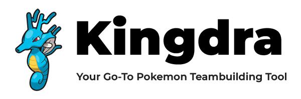

&nbsp;&nbsp;
&nbsp;&nbsp;
&nbsp;&nbsp;

## 👋 Introduction

This is a full-stack Pokemon Teambuilder I am currently building. I started this project because I was building a little teambuilder for a Pokemon draft league for my friends (think fantasy football if it was Pokemon). It morphed into something else entirely when I realized that a lot of the Pokemon teambuilders on the market had pretty terrible UIs and lacked the ability to actually set moves and stats unless you are using something like Pokemon Showdown. There is also a crucial lack of a tool that can create both casual and competitive teams in the same place. I hope to build this application into a tool that can do both and adapt to the user's preferences at any given moment.

## 💻 Demo

Check out the [Demo](https://pokedraft.liambsullivan.com), hosted on Vercel.

## 💪 Features:

- ✅ Infinite Scroll + Tabbing System
- ✅ Proper Responsiveness
- ✅ Stat Calculator using Pokemon's IV/EVs + Natures + Lv
- ✅ Login System via Clerk
- ✅ Smogon Breakdown
- ✅ Ability/Nature/Item/Move Select w/ included metadata
- ✅ Input Validation
- ✅ EV Limit
- ✅ Type Matchup Breakdown
- ✅ Client-Side Searching
- ✅ Multiple Team Support
- ✅ Import/Export Locally + Globally
- ✅ Apollo Client Integration for GraphQL
- ✅ State Management with React
- ✅ Unit Testing with Vitest

## 🛣️ Roadmap

- ❌ Dark Mode Support
- ❌ Search fetches from Backend
- ❌ Custom Sign-in Page
- ❌ Enhanced GraphQL Queries and Mutations
- ❌ Integration with Additional APIs

## 🪲 Known Bugs

- ⚠️ Exports to Showdown may be malformed in cases where EVs are not specified.
- ⚠️ Attacks with dashes (-) are indistinguishable from ones with spaces. This is an API limitation.
- ⚠️ In certain scenarios, the API may be called more than needed after all Pokémon are fetched from infinite scrolling.

## ⚙️ Stack

- [**Next.js** + **TypeScript**](https://nextjs.org) - An all-in-one web framework that includes inbuilt SSR among other optimizations.
- [**Tailwind CSS**](https://tailwindcss.com/) - A utility-first CSS framework that allows classes to be defined in HTML markup.
- [**React**](https://react.dev) - A JavaScript library for building user interfaces.
- [**Flowbite**](https://flowbite.com/) - An extensible UI library built for Tailwind.
- [**Flowbite-React**](https://www.npmjs.com/package/flowbite-react) - React components for the Flowbite UI library.
- [**@clerk/nextjs**](https://www.npmjs.com/package/@clerk/nextjs) - A library for adding authentication and user management to Next.js applications.
- [**MongoDB**](https://www.mongodb.com/) - A NoSQL database for storing user teams and data.
- [**Mongoose**](https://mongoosejs.com/) - An ODM library for MongoDB and Node.js.
- [**Apollo Client**](https://www.apollographql.com/docs/react/) - For managing GraphQL queries and state.
- [**GraphQL**](https://graphql.org/) - A query language for your API.
- [**Axios**](https://axios-http.com/) - A promise-based HTTP client for the browser and Node.js.
- [**Lodash.debounce**](https://lodash.com/docs/4.17.15#debounce) - A utility function that limits the rate at which a function can be called.
- [**Node-Fetch**](https://www.npmjs.com/package/node-fetch) - A light-weight module that brings `window.fetch` to Node.js.
- [**Debounce**](https://lodash.com/docs/4.17.15#debounce) - Utility for debouncing rapid function calls.
- [**Dotenv**](https://www.npmjs.com/package/dotenv) - Loads environment variables from a `.env` file.
- [**Vitest**](https://vitest.dev/) - A blazing fast unit test framework.

### **Dev Dependencies**

- [**@testing-library/react**](https://testing-library.com/docs/react-testing-library/intro/) - For testing React components.
- [**TypeScript**](https://www.typescriptlang.org/) - Type-safe JavaScript.
- [**ESLint**](https://eslint.org/) - For linting JavaScript and TypeScript code.
- [**Prettier**](https://prettier.io/) - Code formatter.
- [**Tailwind CSS Plugins**](https://tailwindcss.com/docs/plugins) - Extending Tailwind's functionality.
- [**Vitest**](https://vitest.dev/) - Unit testing framework.

## 🧞 Commands

All commands are run from the root of the project, from a terminal:

- `npm run dev`: Starts the development server and watches for changes.
- `npm run build`: Runs linting and builds the project for production.
- `npm run start`: Previews the production build locally.
- `npm run lint`: Lints the project using ESLint.
- `npm run test`: Runs the test suite using Vitest.

Make sure to install the dependencies by running `npm install`. To create a new app with Next.js, use `npx create-next-app@latest` instead.
